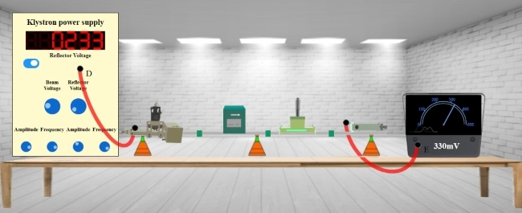
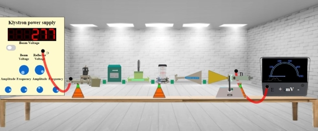

## Procedure 

### Instructions to Record the Value for Transmitting Voltage

**Step-1:** Click on Components button for components to pop up.  
**Step-2:** Click on the "Components", drag them to the test bench and place them as shown in fig. 1.  
  

**Fig. 1 Setup for recording the value for transmitting voltage** 

**Step-3:** After placing the components on the test bench, connect the wires accordingly.  
**Step-4:** If your connections are correct then you may continue to take down the readings, if not then click on "Reset Button" and try it again.  
**Step-5:** Move the "Beam Voltage" knob and set it to 250 or above to record your readings.  
**Step-6:** Toggle the switch button and move the "Reflector Voltage" knob to set the reflector voltage to maximum negative value.  
**Step-7:** As soon as you start varying the reflector voltage you will observe a voltage value on millivoltmeter.  
**Step-8:** Keep varying the "Reflector voltage" till you get maximum voltage at millivoltmeter (You will get maximum voltage value at values between 232 and 240 of voltage).  
**Step-9:** Note down the value for Transmitting Voltage from millivoltmeter  
**Step-10:** Click on "Add to table" button to record the readings for Output Voltage, Beam Voltage and Reflector Voltage.  
**Step-12:** Click on "Print" button to print your current page (readings and connections) or to save your page (readings and connections) in a PDF form. After clicking on "Print Button" set the layout as "Landscape" to get a proper view of the page then go to more settings and click on the checkbox named "Background graphics".  
**Step-13:** Click on "Next" button to calculate gain and to plot radiation pattern of Horn Antenna.

  
  
### Instructions to Record the Value for Gain and Plot the Radiation Pattern for Horn Antenna

**Step-1:** Click on Components button for components to pop up.  
**Step-2:** Click on the "Components", drag them to the test bench and place them as shown in fig. 2. 

  

**Fig. 2 Setup for recording the Value for gain and plot the radiation pattern for horn antenna**

**Step-3:** After placing the components on the test bench, connect the wires accordingly.  
**Step-4:** If your connections are correct then you may continue to take down the readings, if not then click on "Reset Button" and try it again.  
**Step-5:** Once you're done with the connections, you'll notice voltage for Horn Antenna at 0 degree on millivoltmeter.  
**Step-6:** Note down that value for Receiving voltage and click on "Calculate" button to calculate gain at that particular degree.  
**Step-7:** Click on Add to table to take down the values of Gain on that particular degree.  
**Step-8:** Now click on "+" button and Repeat the process for 10 to 90 degree (for anticlockwise direction) as you did for the first reading.  
**Step-9:** Or click on "-" button and Repeat the process for 360 to 270 degree (for clockwise direction) as you did for the first reading.  
**Step-10:** Note down all the readings for anticlockwise direction (0 to 90 degree) as well as for clockwise direction (360 to 270 degree).  
**Step-11:** Click on "Print" button to get your page (readings and connections) in a PDF form.  
**Step-12:** Click on "Plot" button to plot a graph as per your readings.  
**Step-13:** If you want to save the graph click on the camera icon just above the graph.

