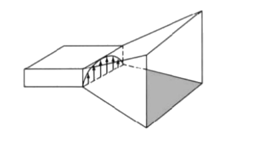
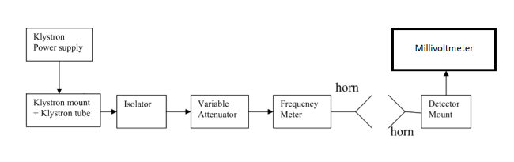

### Introduction

The horn antenna has a distinctive shape and is unlike many other forms of antenna and is used at microwave frequencies. The horn antenna can be considered to be a waveguide that has been widened out in the form of a horn.  

### Basic Horn Antenna Concept

The horn antenna may be considered as an RF transformer or impedance match between the waveguide feeder and free space which has an impedance of 377 ohms. By having a tapered or having a flared end to the waveguide the horn antenna is formed and this enables the impedance to be matched. Although the waveguide will radiate without a horn antenna, this provides a far more efficient match.

**Fig. 1 Horn**

### Pyramidal Horn Antenna

In addition to the improved match provided by the horn antenna, it also helps suppress signals traveling via unwanted modes in the waveguide from being radiated. However the main advantage of the horn antenna is that it provides a significant level of directivity and gain. The pyramid horn antenna takes on a rectangular shape - the cross section through the antenna is rectangular, as is the end of the antenna. It is normally used with rectangular waveguide.

### Radiation Pattern of Horn Antenna

The radiation pattern is a graphical representation of the strength of radiation of an antenna as a function of direction. The strength of radiation is usually measured in terms of field strength although sometimes radiation intensity (power radiated per unit solid angle) is also used. For the purpose of radiation pattern, one considers the given antenna to be located at the origin of a spherical polar coordinates systems (r,θ,φ) and the variation in the field strength at different points on an imaginary concentric spherical surface of radius r is noted. For sufficiently larger r, as explained later on, the field variation or the pattern is independent or r and also the fields are tangential to the hypothetical spherical surface. In general, separate patterns are plotted for θ and φ polarization. The radiation pattern of typical microwave antennas consists of a main lobe and a few minor or side-lobes. Beam-width of an antenna is defined as the angular separation between 3 dB points with respect to the maximum field strength. Side lobes represent a loss and leakage of information in the transmit mode. In the receive mode, sidelobes may cause an uncertainty in determining the angle of arrival of a signal. However, sidelobes are very sensitive to the surroundings in which the radiation pattern is measured.

### Component List

1. **Klystron Power Supply**  
Provides the necessary high voltage and current to the klystron tube, which generates microwave signals used to excite the horn antenna. This supply ensures the klystron operates efficiently at the desired frequency.

2. **Klystron Mount**  
Holds the klystron securely in place, ensuring stability and proper alignment with other components. This is crucial for maintaining consistent output signals during measurements.

3. **Isolator**  
Prevents reflected microwave signals from returning to the klystron, protecting it from potential damage and ensuring stable operation by allowing only unidirectional signal flow.

4. **Attenuator**  
Allows for precise control of the power level of the microwave signal before it enters the horn antenna. This enables adjustments to study how varying input power affects the antenna's performance.

5. **Frequency Meter**  
Measures the frequency of the microwave signals being emitted by the klystron and radiated by the horn antenna. Accurate frequency measurement is essential for characterizing the antenna’s performance.

6. **Horn**  
The horn antenna itself serves as the radiating element. Its design focuses the microwave energy into a narrow beam, enhancing directivity and gain. The horn's shape influences its radiation pattern and efficiency.
 
7. **Detector Mount**  
Holds the microwave detector that measures the output power from the horn antenna. It allows for the assessment of the antenna’s performance by quantifying the power radiated in the desired direction.

8. **Millivoltmeter**  
Measures small voltage levels at the output of the detector. This reading provides information about the power levels being received from the horn antenna, which can be used to analyze the antenna's efficiency and directivity.

### Block Diagram

*   ### For Transmitting Voltage:

    

    

    **Fig. 2 Bench setup for transmitting voltage**

    

    
*   ### For Calculating Gain to Plot Radiation Pattern
    
    

    

    **Fig. 3 Bench setup for calculating gain to plot radiation pattern**

    

    

